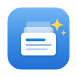

# Thinkstack

**A fast, local-first desktop workspace for notes, tasks, and sticky notes.**

Your data never leaves your machine — everything lives in a local SQLite database.

---

## ✨ Features

### 🗂️ Board
One kanban board for **everything in the app**. Tasks, notes, sticky notes, and orchestration workers all appear as cards across four columns — **Backlog / To do / In progress / Done** — and you drag any of them anywhere. Each card keeps its own identity: a task card has its checkbox, due date and priority, a sticky shows its color, a worker shows whether it's still running. Clicking a card opens the real thing — the note, the sticky window, the Orchestration view.

Cards you've never touched start in a sensible column (a task with a due date lands in **To do**, a running worker in **In progress**) and stay there until you move them; once dragged, your arrangement is saved. **Done stays in sync with the task checkbox both ways** — completing a task anywhere moves its card, and dropping a card into Done ticks it off. Filter the board by card type, or add a task straight into any column.

### 📝 Notes
A block-based rich-text editor (BlockNote) for long-form thinking. Each note has a custom emoji icon, can be **pinned** to the top of the list, and **archived** when you're done with it. Pinned notes always sort first, followed by most recently edited.

### ✅ Tasks
A focused task list with **priorities** (none / low / medium / high), **due dates with an optional time** via a quick picker (Today / Tomorrow / Next week / custom date & time), and **drag-to-reorder**. Tasks are created through the **New task** dialog — title, free-form **description**, due date & time, and priority in one place, with a preview of exactly when the reminder will fire. A progress bar tracks completion, filters show live counts, and any task can be **linked to a note** — the note appears as a chip on the task and one click jumps to it.

### 🔔 Reminders
Tasks with a due date fire a **desktop notification** — at the task's due time if one is set, otherwise at 9:00 on the due day (each task notifies once; changing the date or time re-arms it). macOS will ask for notification permission the first time.

### ✨ AI Assistant (bring your own key)
Connect your own **Anthropic**, **OpenAI**, or **Groq** API key in Settings and use AI right inside your notes: summarize, improve writing, fix grammar, continue writing, extract tasks (added straight to your task list), or ask anything about the current note. Every request carries your **[Memory](#-memory)** context, so you never re-explain your company. Your key is stored in the **system keychain**, requests go **directly from your device to the provider**, and nothing passes through any middleman — if no key is configured, the app makes no network requests at all.

### 🧠 Memory
A **Memory** section for the context you'd otherwise retype into every prompt — what your company does, what you sell, who's on the team, how you want things written. Each memory is a titled card filed under a category (Company / Product / People / Projects / Style & tone / General) that you can **toggle off** without deleting. Every enabled memory is prepended to **every AI request** across the app, so the assistant already knows your world. A **Preview context** panel shows the exact text the model receives, along with a rough token count.

### 🧩 Orchestration
Run **several Claude Code workers in parallel** on one repository. Point Thinkstack at a local git repo, load its open **GitHub issues and pull requests** via the `gh` CLI, and start a worker on each one you want handled. Every worker gets **its own git worktree**, so they edit the same repo at the same time without ever overwriting each other's files, and their progress streams into the app live.

Separate worktrees keep workers off each other's files, but not out of each other's way: two workers can still change the *same* file from different branches, and you'd only find out at merge time. So Thinkstack watches what each one actually touches and **tells you the moment two of them land on the same file** — while you can still redirect one. Each worker is also told who else is running and what they're editing, so it can stay out of their way on its own.

Work that builds on other work can be **queued behind it**: pick "after #12" when starting a worker and it waits, then branches from that worker's finished code once you've approved it. Anything queued behind a worker you discard or stop is failed with a reason rather than left waiting forever.

Autonomy stops at your machine: `git push` and `gh pr create` are **absent from each worker's permission allowlist**, so a worker *cannot* publish — it's blocked, not merely discouraged. Finished workers land in **Needs review**, where you read the diff and then choose **Approve & open PR** or **Push branch only**. Discarding a worker removes its worktree and branch. Letting workers run build and test commands is a separate opt-in checkbox.

### 🗒️ Sticky Notes
Lightweight sticky notes in six colors. Pop any sticky out into its own **frameless, always-on-top floating window** that stays visible over other apps — perfect for reminders and scratch thoughts. Position and size are remembered.

### 🔍 Search & Command Palette
A `⌘K` command palette with **instant full-text search** across every note, powered by SQLite FTS5 with highlighted snippets, plus **quick actions** — create a note, sticky, or memory, jump between views (including the Board), or switch the theme without touching the mouse.

### 🗑️ Trash
Deleted notes move to a **Trash** in the sidebar instead of vanishing. Restore them with one click (or the **Undo** toast right after deleting), delete individual notes forever, or empty the whole trash.

### ⚡ Quick Capture
A global `⌘⇧Space` hotkey opens a centered capture bar from **anywhere on your system** — even when Thinkstack isn't focused — so a thought is never more than a keypress away.

### 🌗 Themes
Light and dark themes that follow your system preference and remember your manual choice.

### 📤 Export, Import & Backup
Your data is yours to take. From **Settings → Your data**, export **every note as Markdown** (one `.md` per note in a dated folder, with front matter other tools read), export **everything as JSON** (notes including trashed ones, tasks, stickies, memories, calendar marks and board layout), or take a **database backup** — a consistent copy of the SQLite file, written with `VACUUM INTO` so nothing still sitting in the write-ahead log is lost. Files go straight to the folder you pick; nothing is uploaded and no copy is kept anywhere else.

A JSON export can be **imported back**, which is how you move a workspace to another machine. Import is **additive**: it shows you exactly what it's about to add before writing anything, and anything already here is left untouched rather than overwritten — so importing the same file twice is harmless, and an import can never quietly replace work you've done since.

### 🔒 Local-First
No cloud, no account, no telemetry. Everything is stored in a local SQLite database (WAL mode) on your machine, and you can [take it out](#-export--backup) whenever you want. The only outbound traffic is what you ask for: AI requests to your chosen provider, and — in Orchestration — `gh` talking to GitHub and an approved `git push`.

## 🔧 Requirements

Notes, tasks, calendar, sticky notes, and memory work with no setup. Two features need extra tooling:

| Feature | Needs |
|---------|-------|
| AI Assistant | Your own Anthropic / OpenAI / Groq API key, added in Settings |
| Orchestration | [`git`](https://git-scm.com), the [`gh` CLI](https://cli.github.com) (run `gh auth login`), and the [`claude` CLI](https://claude.com/claude-code) |

Orchestration tells you which of these are missing rather than failing silently. Because a desktop app launched from Finder doesn't inherit your shell's `PATH`, Thinkstack resolves these binaries through a login shell.

## ⌨️ Shortcuts

| Shortcut | Action |
|----------|--------|
| `⌘K` / `Ctrl+K` | Open the command palette / search |
| `⌘N` / `Ctrl+N` | Create a new note |
| `⌘1` … `⌘8` | Switch view (Board / Notes / Tasks / Calendar / Sticky / Memory / Orchestration / Trash) — mirrors the sidebar top to bottom; hover a sidebar item to see its shortcut |
| `⌘⇧Space` | Toggle quick capture (works globally) |

## 📚 Documentation

- [**DEVELOPMENT.md**](DEVELOPMENT.md) — set up your environment, run, and build the app.
- [**ARCHITECTURE.md**](ARCHITECTURE.md) — how Thinkstack is structured and how data flows.
- [**CONTRIBUTING.md**](CONTRIBUTING.md) — workflow, conventions, and how to submit changes.

---

Built by <a href="https://github.com/Hrishi75">Hrishi75</a>

